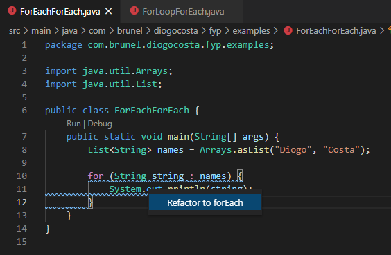
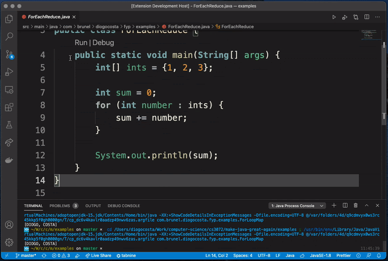

# Make Java Great Again!

_Make Java Great Again: Refactoring to Functional!_, is a dissertation-based project supervised by @BrunelCS and [Dr Rumyana Neykova](https://www.brunel.ac.uk/people/rumyana-neykova), who's sole aim is to increase the usage of functional paradigms in Java and developer's confidence in using these paradigms.

## Features

Currently, this VS Code extension provides code highlighting, quick fixing and refactoring for the following patterns:
* forEach
* map
* reduce

> Code Highlighting
> 
> 
> 
> Quick Fix
> 
> 
> 
> Refactor Entire File
>
> 

### Contributing

In order to get this Project running locally on your machine for contributing, you'll need to clone this repo then run the following:

_Language Server_: `yarn build` (this will generate the appropriate `.jar` files, which need compiling after any changes made)

_VS Code Extension_: `yarn compile` or `yarn watch`, preferably just running it via the Debugger on VS Code

### For more information

* 👨‍🏫 [Presentation](https://docs.google.com/presentation/d/1_jPc1FcllnkuTHoz4-MZNqDyj8vIujrTlvCh0h7rGds/edit?usp=sharing)

**Enjoy!**
